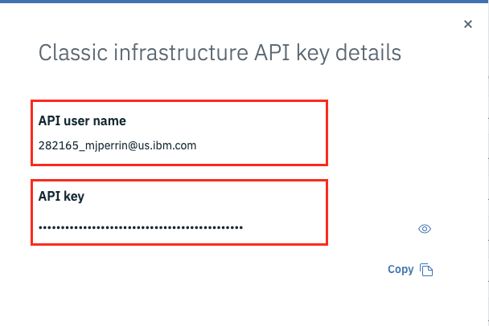
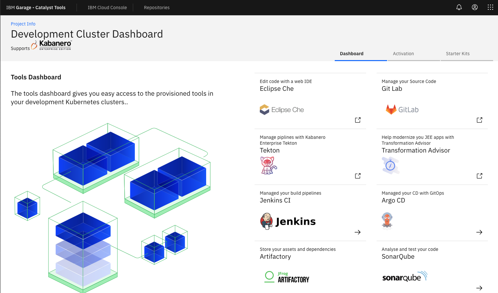

# IBM Garage for Cloud & Solution Engineering
## Iteration Zero for IBM Cloud
This repository contains tools and Terraform infrastructure as code (IasC) to help setup an IBM Cloud Public development
environment ready for cloud native application development with IBM Cloud Kubernetes Service or Red Hat OpenShift for IBM Kubernetes Service. 

### Overview

This repo contains Terraform resources that will deploy the following development tools into your IKS or OpenShift infrastructure.

- IBM Container Service Cluster (3 nodes)
- Create *dev*,*test*,*staging* and *tools* namespaces
- Install the following tools:
    - [Jenkins CI](https://jenkins.io/)
    - [Argo CD](https://argoproj.github.io/argo-cd/)
    - [SonarQube](https://www.sonarqube.org/) 
    - [Pack Broker](https://docs.pact.io/)
    - [Artefactory(tbd)](https://jfrog.com/open-source/)
    - [Eclipse CHE](https://www.eclipse.org/che/)

- Create and bind the following Cloud Services to your Cluster:
    - [AppID Application Authentication](https://cloud.ibm.com/docs/services/appid?topic=appid-service-access-management) 
    - [Cloudant NoSQL Database](https://cloud.ibm.com/docs/services/Cloudant?topic=cloudant-getting-started)
    - [Cloud Object Storage Storage](https://cloud.ibm.com/docs/services/cloud-object-storage?topic=cloud-object-storage-getting-started)
    - [LogDNA Logging](https://cloud.ibm.com/docs/services/Log-Analysis-with-LogDNA?topic=LogDNA-getting-started)
    - [SysDig Monitoring](https://cloud.ibm.com/docs/services/Monitoring-with-Sysdig?topic=Sysdig-getting-started)
    - [PostgreSQL](https://cloud.ibm.com/docs/services/databases-for-postgresql?topic=databases-for-postgresql-about)

## Development Tools


**Warning: The material contained in this repository has not been thoroughly tested. Proceed with caution and report any issues you find.**

## Basic Setup
This section will guide you through basic setup of the environment deployment. You will need access an account with the 
ability to provision on IBM Cloud Public before proceeding.

### Pre-requisites
The following pre-requisties are required before following the setup instructions. 

- An IBM Cloud account with the ability to provision resources to support Kubernetes environment
- A IBM Cloud [Resource Group](https://cloud.ibm.com/account/resource-groups) for you development resources
- Public VLAN, and Private VLAN in IBM Cloud
- [Docker Desktop](https://www.docker.com/products/docker-desktop) installed and running on your local machine
- [Node](https://nodejs.org/en/) installed on your local machine

**Warning: This has only been tested on MacOS.**

### Creating Resource Group
The first step is to create a dedicated Resource Group for your development team. This Resource Group will contain your 
development cluster and supporting cloud services. Using the Cloud Console create a unique 
[Resource Group](https://cloud.ibm.com/account/resource-groups). 


**NOTE:** The terraform scripts can be run to create a new Kubernetes cluster or modify an
existing cluster. If an existing cluster is selected, then any existing namespaces named 
`tools`, `dev`, `test`, and `staging` and any resources contained therein will be destroyed.

## Deploying with Terraform
This section discusses deploying IBM Cloud resources with Terraform. This section uses the [Garage Catalyst Docker Image](https://cloud.docker.com/u/garagecatalyst/repository/docker/garagecatalyst/ibm-garage-cli-tools) to run the Terraform client.

### Getting Started

Once you have followed the steps in the [Basic Setup](#basic-setup) section, clone this repository to your local filesystem.

```bash
$ git clone git@github.ibm.com:garage-catalyst/iteration-zero-iks.git

$ cd iteration-zero-iks
```

Next, copy `credentials.template` to a file called `credentials.properties` then edit the `credentials.properties` file and update the values for the following keys `ibmcloud.api.key`, `classic.username` and `classic.api.key`. 

### Getting API Keys

The IasC requires two API Keys from the platform to enable it to provision the necessary resources. The first Key is 
for the  IBM Cloud resources and the second key is for Classic IaaS Infrastructure resources.

To generate these keys, please visit the following links:
- [IBM Cloud API Key](https://console.bluemix.net/docs/iam/userid_keys.html#creating-an-api-key "Creating an API key")
- [Classic IaaS Infrastructure Username and API Key](https://cloud.ibm.com/docs/iam?topic=iam-classic_keys#classic_keys "Managing classic infrastructure API keys")

The IBM Cloud API Key will later be referred to as: `IBMCLOUD_API_KEY`. The Classic IaaS Infrastructure Key will later 
be referred to as: `CLASSIC_API_KEY` and the Classic IaaS Infrastructure username for that Infrastructure Key is 
`CLASSIC_USERNAME`.

**Note:** To access or create the keys click on `Manage->Access(IAM>)`  Then select `IBM Cloud API keys` menu. If you do not have the Classic API key configured you will have a button at the top asking you to add them. 


Click on `Create a classic infrastructure API Key` close the dialog and then click on the `Details` menu for the classic key in the list. If this button does not appear then the key is already created for you account and just view the `Details` for this key.



You can cut and paste the `API user name` and use this for the `CLASSIC_USERNAME` and click on the `Copy` button and paste this value `CLASSIC_API_KEY`

Final part is create an  `Create an IBM Cloud API Key` Enter a name and description. Once it is created save the value and use it for `IBMCLOUD_API_KEY`

Use the values you copied from the console and added them to the `credentials.properties` file and then save it. This file will also be ignored in git.

```properties
classic.username=<CLASSIC_USERNAME>
classic.api.key=<CLASSIC_API_KEY>
ibmcloud.api.key=<IBMCLOUD_API_KEY>
```

#### Instructions for obtaining VLAN information

To enable Terraform to create a working development cluster we need to obtain the VLAN information from the Classic platform.

To make getting this information as simple as possible we have added a command to a helped CLI tool that will pull will create this information in a format that is easy to use. 

Follow these steps to get the VLAN information:

Install the [IBM Garage Catalyst Tools CLI](https://github.ibm.com/garage-catalyst/ibmcloud-garage-cli):
```bash
npm i -g @garage-catalyst/ibm-garage-cloud-cli
````
Log into your IBM Cloud Account with the correct region and resource group:
```bash
ibmcloud login -a cloud.ibm.com -r <region> -g <resource group>
```

Then run the CLI command to obtain the VLAN information:
```bash
igc vlan
```

You will now have a set of properties that can be directly copied into your `terraform.tfvars` open the file and paste the values into the file and save.

```bash
vi ./terraform/settings/terraform.tfvars
```

These values should look something like the example below. You should have a resource group `catalyst-team` with private VLAN `2372`, public VLAN `1849` in the DAL10 datacenter. Our `terraform.tfvars` would look accordingly:
```terraform
private_vlan_number="2372"
private_vlan_router_hostname="bcr01a.dal10"
public_vlan_number="1849"
public_vlan_router_hostname="fcr01a.dal10"
vlan_datacenter="dal10"
vlan_region="us-south"
resource_group_name="catalyst-team"
cluster_name="catalyst-team-cluster"
```

**NOTE:** If you would like to use an existing cluster, change the value of `cluster_name` in the `terraform.tfvars` to the name
of that cluster.

You can also access this information for the public and private VLANs information by accessing the `Classic Infrastructure` from the IBM Cloud console, and then selecting `Network > IP Management > VLANs` once you have updated your values you can moved to the next step.

### Running Terrform to provision Development Cluster and Tools

Run the following command to launch a Garage [Catalyst CLI Tools Docker container](https://github.ibm.com/garage-catalyst/client-tools-image).

```bash
./launch.sh
```
***NOTE:*** This will install the Cloud Garage Tools docker image and exec shell into the running container. You will run the 
rest of the commands from inside this container. The container will mount the `./terraform/` directory as `/home/devops/src/`. 
This is helpful in sharing files between your host filesystem and your container. 

It will also allow you to continue to extend or modify the base Terraform IasC that has been supplied and tailor it for you 
specific project needs.

The tools docker image contains the following tools that will help you with cloud native development. 

 * terraform (with helm, kube, and ibm provider plugins)
 * calicoctl
 * ibmcloud (with container-service, container-registry, and cloud-databases plugins)
 * kubectl
 * helm
 * docker
 * git
 * nvm
 * node (v11.12.0 currently installed)
 * yo

### Deploying the Iteration Zero resources
Run the following commands:
```bash
$ ./runTerraform.sh
```

The script will prompt if you want to create a new cluster or use an existing cluster. If an existing cluster is selected
the contents will be cleaned up to prepare for the terraform process (the `tools`, `dev`, `test`, and `staging` namespaces).

After that the Terraform Apply process and begin to create the infrastructure and services for your Development Enviroment.

Creating a new cluster takes about 1.5 hours on average (but can also take considerably longer) and the rest of the process
takes about 30 minutes. At the end, you should have your Iteration Zero resources fully provisioned and configured, enjoy!


### Development Cluster Dashboard

To make it easy to navigate to the installed tools, there is a simple dashboard that has been deployed that can help you navigate to the consoles for each of the tools.

To access the dashboard take the the ingress subdomain from the Cluster and prefix it with the word `dashboard`. 

```bash
https://dashboard.catalyst-dev-cluster.us-south.containers.appdomain.cloud

````
This will present you with the following dashboard.



Currently the tools are not linked to a single sign on , other than Jenksin in Open Shift, for not to obtain the credentials for the tools login into ibm cloud account and run `igc credentials` this will list the user id and password secrets

```bash
ibmcloud login -a cloud.ibm.com -r us-south -g catalyst-team
igc credentials
```


### Operations

Now that your development cluster is configured you can now register `LogDNA` and `SysDig` service instances with your Kubernetes cluster. 

Navigate to the Observability menu from the main console menu and then click on the `Edit Sources` and follow the instructions to configure the log agent and montitoring agents. 

### Deploying Code into Pipelines

Now you have a working development environment on the IBM Public Cloud. You can now starting working with code to deploy them into pipelines. The following instructions help describe this process.

[Jenkins Pipeline Creation Instructions](./docs/JENKINS.md)

You can click on the `Starter Kits` tab on the Development Cluster Dashboard and follow the instructions for provisioning a new microservice into your development cluster. You can easily create an microservice by using the github templates listed below:

* [12 UI Patterns with React and Node.js](https://github.com/ibm-garage-cloud/template-node-react)
* [TypeScript Microservice or BFF with Node.js](https://github.com/ibm-garage-cloud/template-node-typescript)
* [GraphQL BFF with Node.js](https://github.com/ibm-garage-cloud/template-graphql-typescript)
* [Spring Boot Java Microservice](https://github.com/ibm-garage-cloud/template-java-spring)

Click on the `Use this template` button to create a repo in your git organisation. Then follow the pipeline registration instructions below, you will need to be logged in OpenShift Console or IKS on the command line. You will also need a [Personal Access Token](https://help.github.com/en/articles/creating-a-personal-access-token-for-the-command-line) from your git organistaion.

```bash
git clone <generated startkit template>
cd <generated startkit template>
vi package.json ! rename template
igc register ! register pipeline with 
? Please provide the username for https://github.com/mjperrins/hello-world-bff.git: mperrins
? Please provide your password/personal access token: [hidden]
? Please provide the branch the pipeline should use: master
Creating git secret
Copying 'ibmcloud-apikey' secret to dev
Registering pipeline
? The build pipeline (mjperrins.hello-world-bff) already exists. Do you want to update it? (Y/n)
```

The pipeline will be created in the `dev` namespace in OpenShift and IKS it will create any necessary secrets required to run the pipeline. The app image will be stored in the IBM Container Registry and deployed into the `dev` name space.

If you want to get easy access to your application routes or ingress end points for your apps run the following command.
```bash
igc ingress -n dev
```

### Destroying
Once your development tools are configured Terraform stores the state of the creation in the `workspace` folder. 

It is is possible to destory the development environment following these steps.

Run the following command to launch a Garage Catalyst CLI Tools Docker container.
```bash
./launch.sh
```
Follow these instructions to run the terraform tool from your `workspace` directory.
```bash
cd src/workspace
terraform destroy
```
This will remove the development cluster and all the services that were created previously.

## Possible Issues

If you find that that the Terraform provisioning has failed try re-running the `runTerraform.sh` script again. The state will be saved and Terraform will try and apply the configuration to match the desired end state.

If you find that some of the services have failed to create in the time allocated. You can manually delete the instances in your resource group. You can then re-run the `runTerraform.sh` but you need to delete the `workspace` directory first. This will remove any state that has been created by Terraform. 

```bash
rm -rf workspace
```

